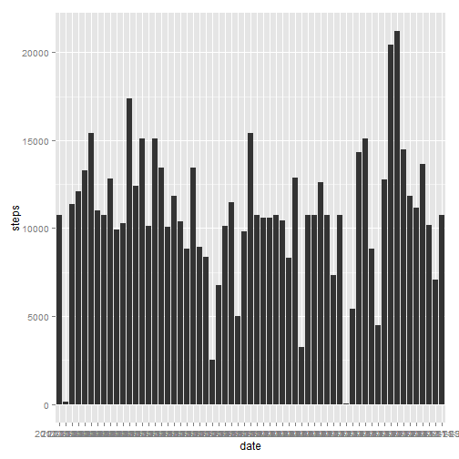

# Reproducible Research: Peer Assessment 1


## Loading and preprocessing the data


```r

opts_chunk$set(fig.path = "./figures/", echo = TRUE)

activity <- read.csv("activity.csv")
library("ggplot2")

# stepCounts <- aggregate(activity$steps, list(activity$date), sum)
# colnames(stepCounts) <- c('date', 'steps')

# change to S3 method for forumula rather than class data.frame

stepCounts <- aggregate(steps ~ date, data = activity, sum)

```


## What is mean total number of steps taken per day?


```r
qplot(date, steps, data = stepCounts, geom = "histogram")
```

```
## Mapping a variable to y and also using stat="bin".
##   With stat="bin", it will attempt to set the y value to the count of cases in each group.
##   This can result in unexpected behavior and will not be allowed in a future version of ggplot2.
##   If you want y to represent counts of cases, use stat="bin" and don't map a variable to y.
##   If you want y to represent values in the data, use stat="identity".
##   See ?geom_bar for examples. (Deprecated; last used in version 0.9.2)
```

 

```r

mean(stepCounts$steps, na.rm = TRUE)
```

```
## [1] 10766
```

```r
median(stepCounts$steps, na.rm = TRUE)
```

```
## [1] 10765
```


## What is the average daily activity pattern?


```r
# calculate the mean steps across days per interval - note that default for
# aggregate is to ignore NA
intervalMean <- aggregate(steps ~ interval, data = activity, mean)

# show a quick plot of the mean steps by intervals
qplot(interval, steps, data = intervalMean, geom = "line")
```

 

```r

# what is the interval, on average across all days, that contains the max
# number of steps
intervalMean[intervalMean$steps == max(intervalMean$steps), ]
```

```
##     interval steps
## 104      835 206.2
```

```r

```


## Imputing missing values


```r
# calculuate the number of missing values
sum(is.na(activity$steps))
```

```
## [1] 2304
```

```r

# use the mean value per interval as an imputation to fill in missing values
# get vector of missings

activityClean <- activity[!is.na(activity$steps), ]
activityNA <- activity[is.na(activity$steps), ]

activityImputed <- merge(activityNA, intervalMean, by = "interval")

# clean imputed data
colsKeep = c("steps.y", "date", "interval")

activityImputed <- activityImputed[colsKeep]
colnames(activityImputed) <- c("steps", "date", "interval")

# merge mean values into missing
activityTotal <- rbind(activityClean, activityImputed)

# plot total number of steps each day
stepImputedCounts <- aggregate(steps ~ date, data = activityTotal, sum)

qplot(date, steps, data = stepImputedCounts, geom = "histogram")
```

```
## Mapping a variable to y and also using stat="bin".
##   With stat="bin", it will attempt to set the y value to the count of cases in each group.
##   This can result in unexpected behavior and will not be allowed in a future version of ggplot2.
##   If you want y to represent counts of cases, use stat="bin" and don't map a variable to y.
##   If you want y to represent values in the data, use stat="identity".
##   See ?geom_bar for examples. (Deprecated; last used in version 0.9.2)
```

 

```r

mean(stepImputedCounts$steps)
```

```
## [1] 10766
```

```r
median(stepImputedCounts$steps)
```

```
## [1] 10766
```


The effect of this method of imputation is to bring the median closer to the mean.  The mean is identical and the median has changed slightly to now match the mean.  This makes sense since we ignored NA's in the first run and replaced them with the means in the second run.


## Are there differences in activity patterns between weekdays and weekends?
